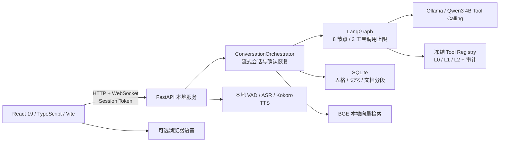

# VoxAgent（声灵）

本地优先的 Windows 流式语音 AI 应用。当前已完成实时语音、长期记忆、本地知识检索和安全单 Agent 工具 MVP；MCP 和 Hybrid RAG 按求职增强路线实施。

面向初级大模型应用 / Agent 工程师作品集：不仅展示对话界面，也保留模型选型、资源测量、严格协议、失败回退和自动化验证证据。

## 当前可运行能力

- 文字与语音共用同一会话；文字输入始终静默回复，实时语音支持流式字幕、短句朗读、插话取消和旧回调隔离。
- 语音默认 `local-only`：麦克风 PCM、SenseVoice/Paraformer ASR、Ollama LLM 与 Kokoro TTS 均走本机回环地址；浏览器在线语音必须由用户显式选择。
- FastAPI HTTP / WebSocket 服务使用严格事件协议和启动期 Session Token，前后端都校验消息关联 ID。
- SQLite 保存会话、单一人格和需确认的长期记忆；敏感记忆由后端策略拦截，并保留来源轮次。
- 可导入 TXT、Markdown、文本 PDF 与 DOCX，使用本地 BGE embedding 做向量检索，并在回答下展示命中的记忆和知识片段。
- Qwen3 原生 Tool Calling 接入有界 LangGraph；六个冻结注册工具按 L0/L1/L2 分级，写操作和应用启动必须单次确认，并保留脱敏审计。
- 支持本地数据导出、完整清空、每日备份、模型身份校验和 CPU / RAM / VRAM / 延迟基准。

实现证据与边界见 [当前能力清单](docs/portfolio/current-capabilities.md)，三分钟演示流程见 [演示脚本](docs/portfolio/demo-script.md)。

## 架构



运行模型、缓存、数据库、导出与日志默认位于 `D:\VoxAgentData`，不进入 Git。仓库内保存代码、测试、模型清单和脱敏后的基准摘要。

## 目标机器实测

提交的 [目标机器基线](benchmarks/target-machine-baseline.json) 来自 i5-9300H（4 核 8 线程）、15.88 GB RAM、GTX 1660 Ti 6 GB 的 Windows 电脑。

| 项目 | 实测结果 | 说明 |
| --- | ---: | --- |
| 默认 LLM | `qwen3:4b-instruct-2507-q4_K_M` | 本机 Ollama，8K 上下文 |
| LLM p95 首 Token | 0.306 s | 3 次固定中文提示，模型身份有 SHA-256 证明 |
| LLM 峰值显存 | 3,783 MiB | 固定提示资源探针 |
| 本地语音：停句到转写 | 0.984 s | 一次真实模型合成回环 |
| 转写到首 Token | 0.229 s | 同一次真实本地闭环 |
| 首 Token 到音频 | 3.919 s | Kokoro CPU 路径，仍是已知体验瓶颈 |

`qwen3.5:4b` 虽通过质量检查，但 30 分钟稳定性测试在约 431 秒因内存压力主动终止，因此没有被选为默认模型。语音自动回环已通过；物理麦克风、扬声器听感与 20 次插话仍需人工验收，不能由单测替代。详见 [语音闭环报告](benchmarks/voice-loop-acceptance.json)。

## 五分钟启动

以下步骤假设 Python 3.12、Node.js、pnpm、Ollama、仓库依赖和本地模型已经按 [Plan 1](docs/plan-01/README.md)、[Plan 2](docs/plan-02/README.md)、[Plan 3](docs/plan-03/README.md) 准备完成。

先在 PowerShell 生成一次性 Token；只在本次终端和 URL 中使用：

```powershell
$sessionToken = [Convert]::ToBase64String(
    [Security.Cryptography.RandomNumberGenerator]::GetBytes(32)
).TrimEnd('=').Replace('+','-').Replace('/','_')
$sessionToken
```

确认 Ollama 已在 `127.0.0.1:11434` 使用 `D:\VoxAgentData\models\ollama` 启动。然后在仓库根目录分别打开两个 PowerShell 窗口。

后端：

```powershell
$sessionToken = '粘贴刚才生成的 Token'
$env:VOXAGENT_DATA_ROOT = 'D:\VoxAgentData'
Set-Location .\backend
& .\.venv\Scripts\voxagent.exe serve --session-token $sessionToken --port 8765
```

前端：

```powershell
Set-Location .\frontend
& .\node_modules\.bin\vite.cmd --host 127.0.0.1 --port 5173
```

浏览器访问 `http://127.0.0.1:5173/?token=粘贴同一个Token`。首次使用知识库前，还需在仓库根目录运行 `& .\scripts\download_embedding_model.ps1 -DataRoot 'D:\VoxAgentData'`。

## 一键验证

在仓库根目录执行：

```powershell
& .\scripts\verify.ps1 -Scope All
```

脚本依次运行后端 pytest、Ruff、前端 Vitest、TypeScript 和 Vite 构建；任一 gate 失败时最终退出非零，同时仍会执行其他独立检查。开发时可改用 `-Scope Backend` 或 `-Scope Frontend`。

Agent MVP 的 12 条确定性路由和 Schema 冒烟评测：

```powershell
Set-Location .\backend
uv run --extra dev voxagent evaluate-agent --dataset ..\benchmarks\agent-mvp-dataset.json --mode fake
```

真实 Ollama 试跑可将 `--mode` 改为 `local` 并用 `--model` 指定本机 Qwen3；它只评估首轮工具选择，不自动批准或执行工具。

## 隐私和安全边界

- 后端、Ollama 与前端开发服务只监听 `127.0.0.1`；API 与 WebSocket 共用一次性 Session Token。
- Token 不写入 `localStorage`、数据库、构建产物、日志或 Git。请勿把带 Token 的完整 URL 放进截图和演示录像。
- 默认仅本地语音不调用浏览器在线识别或非本机语音服务，也不持久化原始麦克风音频。
- 文档内容与记忆作为不可信参考数据注入，不允许覆盖固定的隐私、安全和工具边界。
- 模型只能调用启动时冻结的六个工具；没有 Shell、PowerShell、Python、删除、移动或安装入口。L1/L2 票据绑定 session、turn 和参数哈希，120 秒过期且只能消费一次。
- 清空全部本地数据需要准确输入确认短语；知识文档删除只删本地索引，不删除用户原始文件。

## 已知限制

- JR-02 当前是单 Agent MVP，不是多 Agent 平台；固定评测为 12 条 fake 冒烟集，60 条正式 Agent 集与真实模型稳定性验收仍待 JR-06。
- 工具确认后的恢复回答暂不自动朗读；授权目录目前依赖 SQLite 配置，尚无前端目录管理器。
- 当前没有 MCP Server / Client，不能把原生工具注册表描述成 MCP 互操作能力。
- 当前知识检索是本地向量检索，不是 BM25 + Vector + RRF + Reranker 的 Hybrid RAG，也没有固定金标 RAG 评测集。
- 文本型 PDF 可解析，扫描 PDF 不做 OCR；单文件上限 20 MB。
- Kokoro 本地 CPU 合成首段延迟约 3.9 秒；浏览器在线语音的可用性和隐私取决于浏览器与操作系统平台。
- 尚未完成 Windows CI、结构化日志 / Metrics、Docker 无模型演示包和完整真机人工语音验收。

## 路线图

求职增强按以下顺序推进，未完成项不会提前写入“当前能力”：

1. **JR-01 基线整备：** 全绿测试、一键验证、仓库卫生和作品集说明。
2. **JR-02 安全 Agent 工具 MVP（已完成）：** 有界状态图、原生 Tool Calling、六个工具、权限确认、防重放、前端确认卡和审计；正式评测扩充留到 JR-06。
3. **JR-03 MCP：** 本地 stdio Server / Client、统一 provider 和攻击矩阵。
4. **JR-04 Hybrid RAG：** FTS5 + Vector + RRF + ONNX Reranker 与金标评测。
5. **JR-05 可观测与交付：** 脱敏日志、Metrics、CI、Docker Demo 和运维文档。
6. **JR-06 硬件验收：** 真实插话、30 分钟稳定性和最终求职发布证据。

完整顺序、验收阈值和岗位映射见 [初级 Agent 求职增强路线图](docs/superpowers/plans/2026-09-09-junior-agent-job-readiness-roadmap.md)；杭州岗位差距分析见 [岗位匹配报告](docs/portfolio/hangzhou-junior-agent-role-gap-analysis.md)。
